# Corrected integrity and recoverability flowchart

> **Working planning artifact for [Set the immutable compression and fail-open contract](https://github.com/Sheape/pi-sandwich/issues/5).** The [working decision record](./DECISION-RECORD.md) explains the guarantees, amendments, MVP boundary, and unresolved decisions.

```mermaid
flowchart TD
    A[Receive complete Pi-visible tool_result envelope] --> B[Freeze with explicit versioned canonical framing]
    B --> C[Compute local payload and envelope<br/>hashes plus byte lengths]
    C --> D[Apply infallible declarative static scopes]

    D --> M{Statically eligible<br/>specialized adapters?}
    M -- None --> GO[Generic candidate owner]
    M -- One or more --> DM[Run all eligible dynamic matchers<br/>Same immutable input<br/>Pure, isolated, bounded]
    DM --> MF{Any eligible matcher<br/>failed or became indeterminate?}
    MF -- Yes --> SAFE[Record diagnostic and use safe fallback]
    MF -- No --> WIN{Highest-priority matches}
    WIN -- None --> GO
    WIN -- One unique winner --> SO[Specialized candidate owner]
    WIN -- Tied winners --> SAFE
    SAFE --> FP{Configured fallback}
    FP -- Default --> GL[Generic candidate owner<br/>Approved lossless cleanup only]
    FP -- Strict or debug --> RAW[Return untouched Pi-visible result]

    GO --> P[Produce exactly one candidate]
    SO --> P
    GL --> P
    P --> F{Requested fidelity}
    F -- irreversibly-lossy --> RAW

    subgraph LOSSLESS[Verified-lossless proof]
      L1[Transform in a genuinely terminable execution boundary]
      L2[Optional versioned codec chain<br/>No arbitrary post-adapter cleanup]
      L3[Restore by reversing the complete codec chain]
      L4{Reconstructed canonical payload<br/>exactly equals original?}
      L5{Compatible decoder lifetime<br/>guaranteed for retained history?}
      L1 --> L2 --> L3 --> L4
      L4 -- Yes --> L5
    end

    F -- verified-lossless candidate<br/>MVP: approved core-bundled codecs only --> L1
    L4 -- No --> FAIL[Discard candidate<br/>Abort PREPARED evidence if present<br/>Emit specific diagnostic<br/>Fail open]
    L5 -- No --> FAIL

    subgraph EXTERNAL[Verified-externally-recoverable proof]
      E1[Core generates stable evidence ID]
      E2[Write exact canonical bytes to staged storage]
      E3[Read staged bytes back]
      E4{Recomputed hash and length<br/>match local identity?}
      E5[Mark evidence PREPARED]
      E6[Give owner immutable provisional receipt<br/>No evidence-store capability]
      E7[Transform in a genuinely terminable execution boundary]
      E1 --> E2 --> E3 --> E4
      E4 -- Yes --> E5 --> E6 --> E7
    end

    F -- verified-externally-recoverable candidate --> E1
    E4 -- No --> FAIL

    L5 -- Yes --> PV[Independently validate final model-visible presentation]
    E7 --> PV
    PV --> TRUTH{Typed claims, statuses, counts,<br/>excerpts, omissions, ordering permissions,<br/>and references are truthful?}
    TRUTH -- No or indeterminate --> FAIL
    TRUTH -- Yes --> CORE[Core constructs a new presentation sequence<br/>Every compact block has verified origin provenance<br/>Frozen envelope identities and original block order remain unchanged]
    CORE --> FC{Final contract passes<br/>and configured savings threshold met?}
    FC -- No --> FAIL

    FC -- Yes --> CF{Candidate fidelity}
    CF -- verified-lossless --> CM[Commit versioned fidelity, canonical identity,<br/>owner, codec chain, metadata, and decoder requirements]
    CF -- verified-externally-recoverable --> EP[Atomically COMMIT and PIN prepared evidence<br/>MVP tier survives process crash and restart<br/>Bind complete receipt into immutable history metadata]
    CM --> PATCH[Return exactly one replacement patch]
    EP --> PATCH
    PATCH --> IMM[Pi inserts compact result once<br/>History entry becomes immutable and opaque]

    FAIL --> RAW

    IMM --> R{Later explicit recovery request}
    R -- verified-lossless --> RL[Load pinned compatible decoder and codec versions<br/>Restore and verify against committed original identity]
    R -- verified-externally-recoverable --> RE[Fetch using committed receipt<br/>Recompute and compare against immutable history metadata]
    R -- raw --> RN[Original already present]
    RL --> RV{Recovery verification passes?}
    RE --> RV
    RV -- Yes --> NEW[Return verified original as a new result<br/>Never rewrite compact history]
    RV -- No --> ERR[Return explicit recovery error<br/>Never claim successful recovery]

    classDef safe fill:#d9f2e6,stroke:#16794b,color:#111;
    classDef failure fill:#fde2e2,stroke:#b42318,color:#111;
    classDef decision fill:#fff3cd,stroke:#9a6700,color:#111;
    classDef immutable fill:#e5e7ff,stroke:#4f46e5,color:#111;

    class PATCH,NEW safe;
    class RAW,FAIL,ERR failure;
    class M,MF,WIN,FP,F,L4,L5,E4,TRUTH,FC,CF,R,RV decision;
    class IMM immutable;
```



## Contract summary

```text
receive Pi-visible tool result
→ freeze versioned canonical envelope
→ compute payload and envelope identities
→ determine one candidate owner without uncertainty
→ produce one bounded candidate
→ prove requested recoverability
→ independently validate the model-visible projection
→ reconstruct immutable envelope under core authority
→ commit required evidence or codec metadata
→ insert one immutable replacement
→ recover later through a fidelity-specific verified path
```

Any failed or indeterminate required stage returns the complete original Pi-visible result unchanged. Ambiguity and matcher failure reduce compression aggressiveness. Evidence proves recoverability, never truthfulness.

The MVP is external-first: semantic adapters use verified external recovery; specialized lossless adapters remain disabled until retained-history decoder lifetime is guaranteed.
