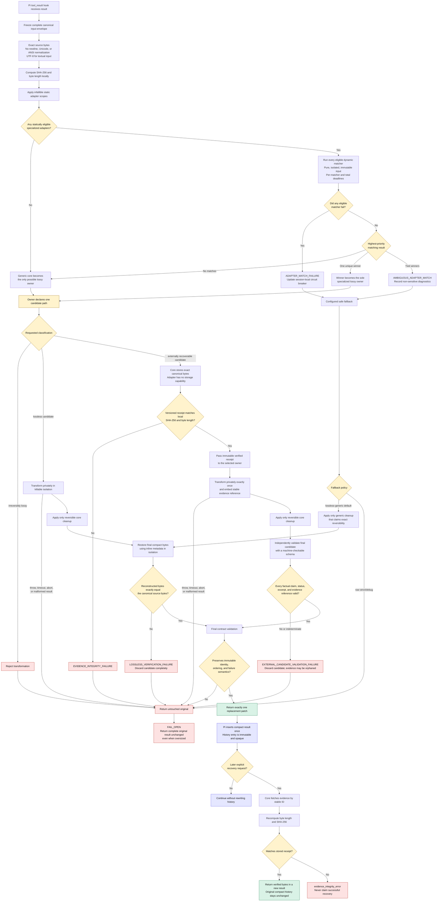

# Shared compression contract flowchart

> **Planning artifact for [Set the immutable compression and fail-open contract](https://github.com/Sheape/pi-sandwich/issues/5).** This describes the agreed contract, not implemented behavior.

## Governing invariants

1. **One input:** all matching sees the same untouched, immutable canonical envelope.
2. **One owner:** at most one specialized adapter or the generic core owns lossy reduction; owners never chain.
3. **Three classifications:** `lossless`, `externally recoverable`, and forbidden `irreversibly lossy`.
4. **Evidence is not validation:** a valid receipt proves recoverability, not that compact context is truthful.
5. **One visible outcome:** the pipeline returns one fully validated compact patch or the untouched original.
6. **Immutable history:** compact results are inserted once; recovery appends a new result rather than rewriting history.
7. **Failure stays failure:** command failure status and mechanically verifiable diagnostics survive compression.
8. **Uncertainty reduces compression:** ambiguity, matcher failure, timeout, corruption, or indeterminate validation selects lossless cleanup or fail-open behavior.
